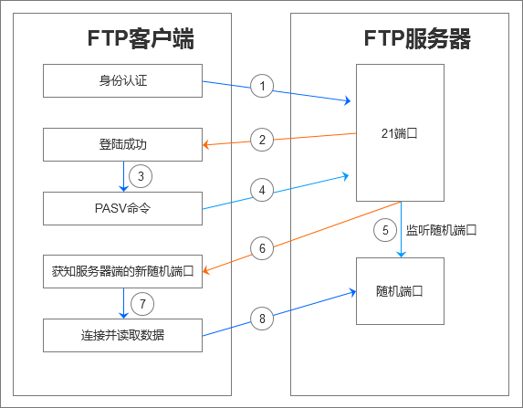
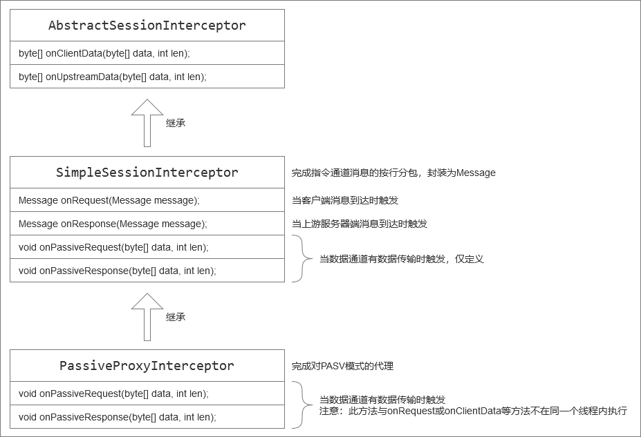

## 适用于JT/T 1078协议的FTP上传代理服务器
为JT/T 1078协议的音视频上传所准备的FTP代理服务器，为了得到文件上传量而定制的FTP代理服务器。因为1078协议里要求音视频的上传要通过FTP服务器，而一般有需求需要得知上传文件的大小进度，用于给前端提供进度展示，而直接搭建FTP服务器的话，就无法得上传进度，而自己实现一个FTP服务器又太麻烦，所以本项目作为FTP代理，顺带实时探测已上传的数据量。后面还会再找时间，实现一个较完整的FTP服务器。

### PASV模式与代理
FTP在交互时，一般会使用两个连接，通常是主连接用于指令交换，副连接用于数据交换，而现在主流的都是使用的PASV模式，就比如在执行`ls`指令的时候，服务器端会通知客户端它打开了哪个随机的新端口，让客户端连上去，以接收前一个指令的数据结果，一般流程如下图：

### 定制开发
为了方便说明，下面将使用**指令通道**、**数据通道**这两个名词来说明代理定制开发上的一些事情。目前项目已经完成了FTP通信的数据流程管理，可通过实现抽象类`AbstractSessionInterceptor`来完成自定义的数据流拦截或监听，目前基于此类有向下两层的实现，分别为完成了按行分包的过程，和PASV模式重写代理的过程。

以下数据拦截器的继承关系：

1. 首先，所有的下游客户端的上行指令都会通过`onClientData()`方法，所有上游服务器的指令响应都会通过`onUpstreamData`，我们可以在这个方法里，完成对上行或下行的数据窜改并返回，这样可以完成FTP指令的拦截或监听。这一层完成原始数据的交换。
2. 而`SimpleSessionInterceptor`则完成了按行对上行或下行的指令数据的分包，封装成简单的`Message`对象，继承此类可以让开发更加简单，因为FTP指令就是按行进行对话的，我们在这一层上，可以针对不同的指令，做出不一样的响应或修改。
3. `PassiveProxyInterceptor`则完成了对**PASV被动模式**的代理，通过对**227**或**229**响应的修改，完成本地建立**数据通道**的传输代理，确保内网里的FTP服务器能够正常的完成数据交换。继承此类将能够确保在内网里的FTP服务器完全可用。

> 注意，`Interceptor`抽象类每一层都有它自身的使命所在，如果要完成自己的拦截器，注意对上层方法的调用，下层的实现类是对于上层抽象类的**补充**，而**不是覆盖**，切记。

### QQ群交流
QQ群号：808432702，一起交流各种部标协议。